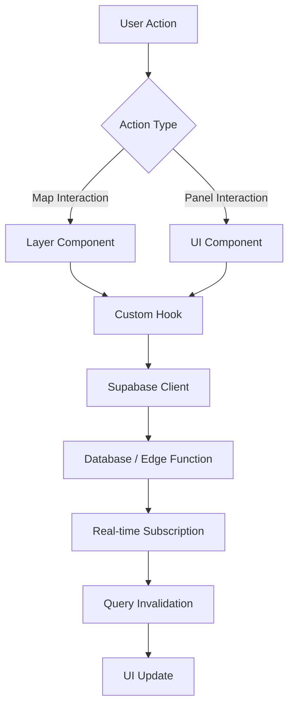

# BIKO Tactical Map — Technical Guide

## Overview

The BIKO Tactical Map is a command-center-grade interface for real-time fleet operations management. It provides dispatchers with situational awareness and actionability through map-based visualization, real-time status updates, and quick operational workflows.

---

## Architecture

### Component Hierarchy

```
TacticalMap (page)
├── LeafletMapCore (base map)
├── MapToolsToolbar (left controls)
├── Layer Components
│   ├── VehiclesLayer (markers with payload rings)
│   ├── DriversLayer (markers with pulse animation)
│   ├── FacilitiesLayer (location markers)
│   ├── WarehousesLayer (hub markers)
│   ├── RoutesLayer (polylines)
│   ├── HandoffsLayer (dotted trails)
│   └── ZoneLayer (polygons)
├── UI Panels
│   ├── BottomDataPanel (tabs: Drivers | Vehicles | Places)
│   ├── VehicleDrawer (right panel)
│   ├── EventStreamDrawer (right panel)
│   └── HandoffFlowDialog (modal)
└── MapLegend
```

### Data Flow



---

## Design System

### Token System

All visual design decisions flow through CSS custom properties defined in `src/styles/biko-tokens.css`:

**Color Tokens:**
- `--biko-primary`: Primary action color (blue)
- `--biko-secondary`: Secondary accent (purple)
- `--biko-success`: Success state (green)
- `--biko-warning`: Warning state (amber)
- `--biko-danger`: Error/critical state (red)
- `--biko-muted`: Subdued text/elements

**Spacing Tokens:**
- `--biko-space-{1-6}`: 4px increments (4px, 8px, 12px, 16px, 24px, 32px)

**Motion Tokens:**
- `--biko-ease`: Smooth cubic-bezier easing
- `--biko-duration-{fast|normal|slow}`: Standard durations

### Usage in Components

```tsx
// ✅ CORRECT: Use semantic tokens
<div className="bg-card text-foreground border-biko-primary">

// ❌ WRONG: Direct color values
<div className="bg-blue-500 text-white">
```

---

## Key Features

### 1. Vehicle Payload Visualization

**Component:** `VehiclesLayer.tsx`

**Features:**
- Real-time payload rings showing capacity utilization
- Color-coded thresholds: green (<60%), amber (60-90%), red (>90%)
- Click to open VehicleDrawer with full details

**Data Source:**
- `vehicles` table (position, status)
- `payload_items` table (weight, volume)
- Calculated via `useVehiclePayload` hook

**Implementation:**
```tsx
const icon = MapIcons.vehicle(
  payload?.utilizationPct || 0,
  selectedVehicle === vehicle.id,
  vehicle.status
);
```

### 2. Handoff Management

**Components:** `HandoffsLayer.tsx`, `HandoffFlowDialog.tsx`

**Workflow:**
1. Click "Initiate Handoff" on vehicle
2. Select destination vehicle
3. Choose batch to transfer
4. Set handoff location (map click)
5. Preview dotted trail
6. Confirm → creates handoff record

**Edge Functions:**
- `create-handoff`: Validates vehicles/batch, creates record, sends notifications
- `confirm-handoff`: Completes transfer, updates batch ownership

**Database:**
```sql
handoffs {
  id, from_vehicle_id, to_vehicle_id, from_batch_id,
  location_lat, location_lng, scheduled_time, actual_time,
  status (planned | in-progress | completed | cancelled)
}
```

### 3. Real-time Event Stream

**Component:** `EventStreamDrawer.tsx`

**Event Types:**
- Zone entry/exit
- Geofence breaches
- Handoff scheduled/completed
- Batch status changes

**Data Source:**
- `zone_alerts` table
- Real-time subscription via `useZoneAlerts`
- Toast notifications on new events

### 4. Zone Drawing & Editing

**Component:** `ZoneLayer.tsx`

**Features:**
- Create polygons with Leaflet Draw
- Name and color zones
- Toggle visibility
- Edit vertices (admin only)
- Delete zones

**Backend:**
- `create-service-zone` edge function
- `update-service-zone` edge function
- Stores GeoJSON in `service_zones.geometry`

---

## API Contracts

### Edge Functions

#### `POST /functions/v1/create-handoff`

**Request:**
```json
{
  "from_vehicle_id": "uuid",
  "to_vehicle_id": "uuid",
  "from_batch_id": "uuid",
  "location_lat": -1.2921,
  "location_lng": 36.8219,
  "scheduled_time": "2025-10-20T12:00:00Z",
  "notes": "string"
}
```

**Response:**
```json
{
  "success": true,
  "handoff": { "id": "uuid", ... },
  "message": "Handoff created successfully"
}
```

#### `POST /functions/v1/confirm-handoff`

**Request:**
```json
{
  "handoff_id": "uuid",
  "actual_time": "2025-10-20T12:15:00Z"
}
```

**Response:**
```json
{
  "success": true,
  "message": "Handoff confirmed successfully",
  "handoff_id": "uuid"
}
```

#### `POST /functions/v1/calculate-payload`

**Request:**
```json
{
  "batch_id": "uuid"  // or "vehicle_id"
}
```

**Response:**
```json
{
  "total_weight_kg": 450.5,
  "total_volume_m3": 3.2,
  "utilization_pct": 75,
  "capacity_weight_kg": 600,
  "capacity_volume_m3": 5,
  "item_count": 12,
  "warnings": ["Vehicle is near capacity"]
}
```

---

## Custom Hooks

### `useVehiclePayload(vehicleId: string)`

Fetches real-time payload data for a vehicle.

**Returns:**
```typescript
{
  items: PayloadItem[],
  totalWeight: number,
  totalVolume: number,
  utilizationPct: number,
  capacityWeight: number,
  capacityVolume: number
}
```

### `useHandoffFlow()`

Manages handoff workflow mutations.

**Returns:**
```typescript
{
  createHandoff: (params) => Promise<void>,
  confirmHandoff: (params) => Promise<void>,
  cancelHandoff: (id) => Promise<void>,
  isCreating: boolean,
  isConfirming: boolean,
  isCancelling: boolean
}
```

### `useZoneAlerts()`

Subscribes to real-time zone alerts.

**Returns:**
```typescript
{
  data: ZoneAlert[],
  acknowledgeAlert: (id: string) => void
}
```

---

## Accessibility

### Keyboard Navigation

- **Tab**: Cycle through interactive elements
- **Enter**: Activate buttons, open panels
- **Escape**: Close drawers/modals
- **Arrow Keys**: Navigate lists

### ARIA Attributes

All interactive map markers include:
```tsx
<Marker
  eventHandlers={{ click: handleClick }}
  keyboard={true}
  tabIndex={0}
  alt="Vehicle ABC-123"
/>
```

Drawers use focus trapping:
```tsx
<Sheet open={open} onOpenChange={setOpen}>
  <SheetContent>
    {/* Focus is trapped here when open */}
  </SheetContent>
</Sheet>
```

### Screen Reader Support

- All icons have `aria-label` attributes
- Event stream has `role="log"` and `aria-live="polite"`
- Form controls have associated `<Label>` elements

---

## Performance Optimization

### Map Rendering

- **Marker Clustering**: Enabled for >50 markers per type
- **Canvas Renderer**: Used for polylines/polygons
- **Debounced Updates**: Map position changes debounced 300ms
- **Lazy Loading**: Layer components only render when visible

### Data Fetching

- **Query Caching**: React Query cache time 5 minutes
- **Stale While Revalidate**: Show cached data while refetching
- **Real-time Subscriptions**: Single channel per table
- **Optimistic Updates**: UI updates before server confirmation

---

## Testing Strategy

### Unit Tests

```typescript
// hooks/useVehiclePayload.test.tsx
describe('useVehiclePayload', () => {
  it('calculates utilization percentage correctly', () => {
    // Mock data
    // Assert calculations
  });
});
```

### Integration Tests

```typescript
// components/HandoffFlowDialog.test.tsx
describe('HandoffFlowDialog', () => {
  it('completes handoff workflow', async () => {
    // Render component
    // Select vehicles
    // Submit form
    // Assert edge function called
  });
});
```

### E2E Tests

```typescript
// e2e/tactical-map.spec.ts
test('dispatcher creates and confirms handoff', async ({ page }) => {
  await page.goto('/fleetops/tactical');
  await page.click('[data-vehicle-id="abc"]');
  await page.click('text=Initiate Handoff');
  // ... complete workflow
  await expect(page.locator('.toast')).toContainText('Handoff confirmed');
});
```

---

## Troubleshooting

### Map Not Rendering

**Issue:** Blank map area

**Solutions:**
1. Check console for tile loading errors
2. Verify `VITE_SUPABASE_URL` environment variable
3. Ensure `LeafletMapCore` receives valid `center` prop
4. Call `map.invalidateSize()` after layout changes

### Real-time Updates Not Working

**Issue:** Data not updating automatically

**Solutions:**
1. Check Supabase realtime is enabled for table
2. Verify subscription cleanup in `useEffect` return
3. Check browser console for WebSocket errors
4. Ensure RLS policies allow real-time access

### Markers Not Clickable

**Issue:** Click events not firing

**Solutions:**
1. Verify `keyboard={true}` prop on Marker
2. Check z-index layering (vehicles should be above zones)
3. Ensure event handlers are memoized
4. Check for overlapping interactive elements

---

## Future Enhancements

- [ ] Historical playback (scrub through past routes)
- [ ] Predictive ETA using traffic data
- [ ] Driver mobile app integration
- [ ] Multi-fleet comparison view
- [ ] Advanced analytics dashboard
- [ ] Voice commands for hands-free operation

---

## Related Documentation

- [Design System Tokens](./DESIGN_TOKENS.md)
- [Component Library](../src/components/map/README.md)
- [Database Schema](../supabase/README.md)
- [Edge Functions](../supabase/functions/README.md)
